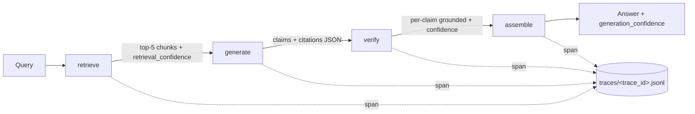

# Grounded RAG over a Single PDF

A small, sharp RAG system over `data/voo.pdf` (a Vanguard VOO fact sheet) that demonstrates two ideas at production quality: span-level grounding with a verifier loop, and full agent observability via a tamper-evident audit log. About 500 lines total, focused on doing two things well.

## The two questions this answers

1. **Can you trust the answer?** Every claim is cited (page, section, verbatim snippet) and then independently verified by a second Claude call. You get a per-claim grounded flag and a generation-wide confidence score, not just a one-shot answer.
2. **Can you audit how you got there?** Every LangGraph node persists a hash-chained Span. Tamper with any byte of any past run and `verify-log` will tell you exactly where the chain broke.

## Architecture



## Grounding design

Two confidence signals are exposed end to end:

- **retrieval_confidence per chunk** = `0.7 * cosine + 0.3 * section_match`. The section boost captures the common case where the user names a section the PDF uses verbatim (for example, "expense ratio" matches the "Expense ratio comparison" section).
- **generation_confidence** = mean verifier confidence across claims. The verifier is a separate Claude call that sees only the claim, the snippet, and the source chunk, and returns `{grounded, reason, confidence}`.

The generator is constrained to a strict JSON schema and is instructed to set `citation: null` rather than invent. The verifier marks any claim without a citation as ungrounded with confidence 0.0.

## Observability design

Every node writes a `Span` to `traces/<trace_id>.jsonl`:

```python
class Span(BaseModel):
    span_id: str
    parent_id: str | None
    trace_id: str
    name: str
    start: str
    end: str
    input: dict
    output: dict
    reasoning: str
    prev_hash: str
    this_hash: str   # sha256(prev_hash + canonical_json(body))
```

`canonical_json` is sorted-keys, no whitespace. The body excludes `prev_hash` and `this_hash` so the prefix is the only carrier of the chain link. The result is an append-only, tamper-evident log: if anyone rewrites a past span (a payload, an input, a timestamp), the recomputed `this_hash` no longer matches what was stored, and `verify-log` reports the exact line.

This matters in regulated industries (finance, healthcare, legal) where "what did the model say at 2:14pm on Tuesday, and why" is a real auditor question. Standard log shipping does not give you that guarantee. A hash chain gives you a cheap, local, after-the-fact proof.

Optional Langfuse integration is gated by `LANGFUSE_PUBLIC_KEY`. Local audit log is always on.

## Run

```bash
python3.11 -m venv .venv && source .venv/bin/activate
pip install -r requirements.txt
cp .env.example .env  # then put a real ANTHROPIC_API_KEY in

python -m grounded_rag.cli index data/voo.pdf
python -m grounded_rag.cli ask "what is the expense ratio?"
python -m grounded_rag.cli verify-log traces/sample_01.jsonl
python -m grounded_rag.cli eval
pytest -v
```

The first `index` run downloads the `all-MiniLM-L6-v2` embedding model (~80MB) from Hugging Face. The `ask` and `eval` commands need a live `ANTHROPIC_API_KEY`. The tests do not (they use a fake client and a deterministic hashing encoder).

If Hugging Face is unreachable (corporate proxy, air-gapped CI), drop the equivalent ONNX weights into `.onnx_cache/onnx/` and the retriever will use them automatically:

```bash
mkdir -p .onnx_cache
curl -sL https://chroma-onnx-models.s3.amazonaws.com/all-MiniLM-L6-v2/onnx.tar.gz \
  | tar -xz -C .onnx_cache
pip install onnxruntime tokenizers
```

## Model note

The spec names `claude-sonnet-4-5`. Set `ANTHROPIC_MODEL` in `.env` to override without code changes (e.g. to `claude-sonnet-4-6`).

## Tradeoffs and what is next

- **Section detection is heuristic.** Font size, bold flags, and a small reject list (bullets, sentences, footnote markers) work for this PDF. For richer documents a dedicated layout model (Unstructured, GROBID) is the next step.
- **No re-ranker.** A cross-encoder pass (for example `ms-marco-MiniLM-L-6-v2`) over the top-20 candidates would meaningfully improve top-5 precision before generation.
- **Single-hop only.** No follow-up retrieval. Multi-hop questions ("how did sector X change between two filings?") would require a planning loop and a second retrieval call.
- **Eval is canned.** Five questions over one PDF is enough for a demo. A real harness needs labeled gold spans and span-overlap F1 instead of generation_confidence as the headline metric.
- **Verifier is a Claude call.** Faster, cheaper alternatives: NLI models, exact-string-overlap checks for numeric facts. The Claude call is the most flexible and lets us defer the precision/cost tradeoff.
